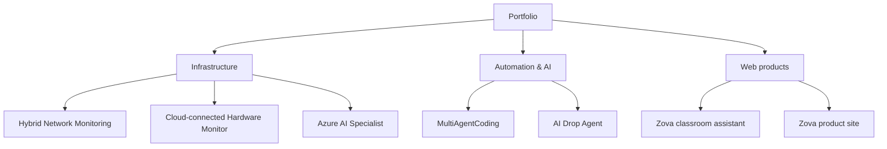
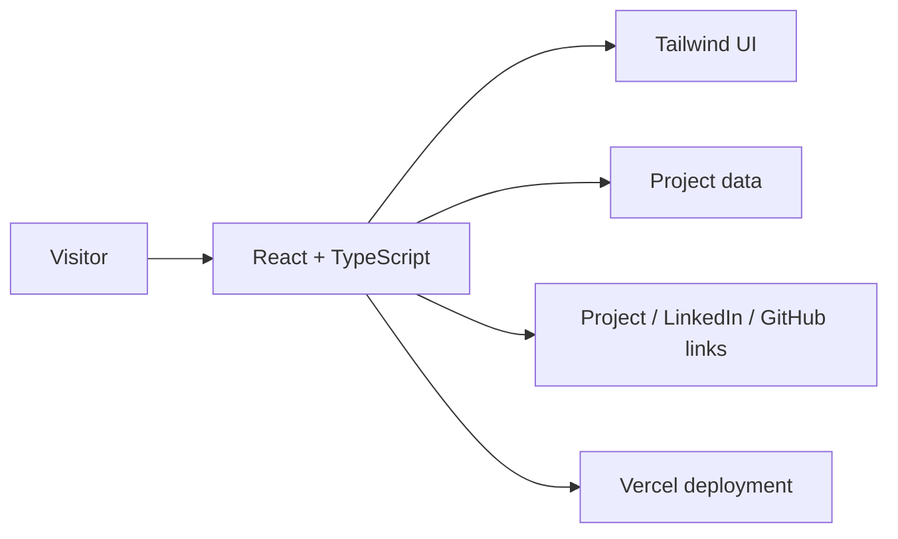

# Vahid Rahmani — Cloud & Infrastructure Portfolio

> Personal portfolio for hands-on work across Azure, Windows Server, Linux, networking, Python, automation, and practical AI-enabled tools.

<p align="center">
  <a href="https://vahid-portfolio-three.vercel.app/"></a>
  <a href="https://www.linkedin.com/in/vahid-rahmani-699944417/"></a>
  <a href="https://github.com/Vahid-Rahmani"></a>
</p>

## What this portfolio communicates

The site brings together infrastructure labs, monitoring tools, automation experiments, and learning products in one evidence-led profile. Each featured project is presented with its purpose, technology choices, current state, and repository link so a reviewer can move from overview to implementation quickly.

## Focus areas

| Area | Evidence in the project collection |
| --- | --- |
| Cloud & infrastructure | Azure architecture, monitoring, hybrid networking and deployment planning |
| Systems administration | Windows Server, Active Directory, PowerShell remoting and Linux practice |
| Automation | Python utilities, repeatable workflows, data collection and operational tooling |
| AI engineering | RAG/data pipelines, multi-agent workflow orchestration and classroom assistance |
| Web delivery | React, TypeScript, Vite, Tailwind CSS and Vercel deployment |
| Hardware & networking | Raspberry Pi, IoT monitoring concepts, diagnostics and network fundamentals |

## Featured project map



## Selected projects

- [Automated Hybrid Network & Monitoring Dashboard](https://github.com/Vahid-Rahmani/Automated-Hybrid-Network-Monitoring-Dashboard) — Active Directory discovery, reachability checks, Windows host metrics, and a FastAPI dashboard.
- [Cloud Connected Hardware IoT Monitor](https://github.com/Vahid-Rahmani/Cloud-Connected-Hardware-IoT-Monitor) — Raspberry Pi / hardware monitoring direction connected to cloud telemetry concepts.
- [Azure AI Specialist Project Plan](https://github.com/Vahid-Rahmani/Azure-AI-Specialist-Project-Plan) — data-first Azure knowledge collection, evaluation, RAG, and model strategy.
- [MultiAgentCoding](https://github.com/Vahid-Rahmani/mullti_agent_coding) — visual orchestration and control plane for multi-agent coding workflows.
- [AI Drop Agent](https://github.com/Vahid-Rahmani/AI-Drop-Agent) — automation project for product discovery and marketplace workflows.
- [Zova extension](https://github.com/Vahid-Rahmani/dobzova) — Chrome classroom assistant for transcription, translation, study support, and local class history.
- [Zova product site](https://zovasite.vercel.app/) — public product landing page, guide, privacy information, and support content.

## Site architecture



The portfolio is a Vite-powered React application. Project content is kept in the source data layer so it can be reviewed and updated without scattering project details across UI components.

## Local development

Requirements: Node.js and pnpm.

```bash
pnpm install
pnpm dev
pnpm build
```

The production build is emitted to `dist/` and is configured for Vercel deployment.

## Professional profile

I am a Cloud Engineer Trainee and IT infrastructure practitioner in Hamburg, Germany, focused on Azure, Windows Server, Linux, networking, Python, and practical automation. My projects are built as learning evidence: clear scope, reproducible setup, and an honest separation between implemented features and future work.

Languages: German, Persian, and English.

## Links

- [Live portfolio](https://vahid-portfolio-three.vercel.app/)
- [LinkedIn](https://www.linkedin.com/in/vahid-rahmani-699944417/)
- [GitHub](https://github.com/Vahid-Rahmani)
